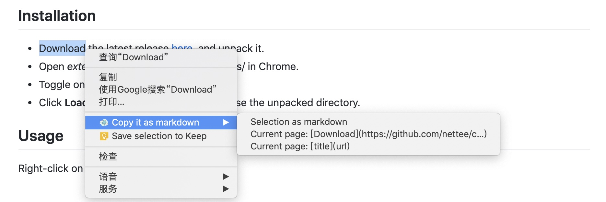

# Copy it as markdown 

Copy your selected text or page link in browser and turn it into markdown snippet!

## Installation

+ Download the latest release [here](https://github.com/nettee/copy-it-as-markdown/releases), and unpack it.
+ Open _extensions_ page [chrome://extensions/](chrome://extensions/) in Chrome.
+ Toggle on **Developer mode** on top right.
+ Click **Load unpacked extension** and choose the unpacked directory.

## Usage

Right-click on your web page to use it!
